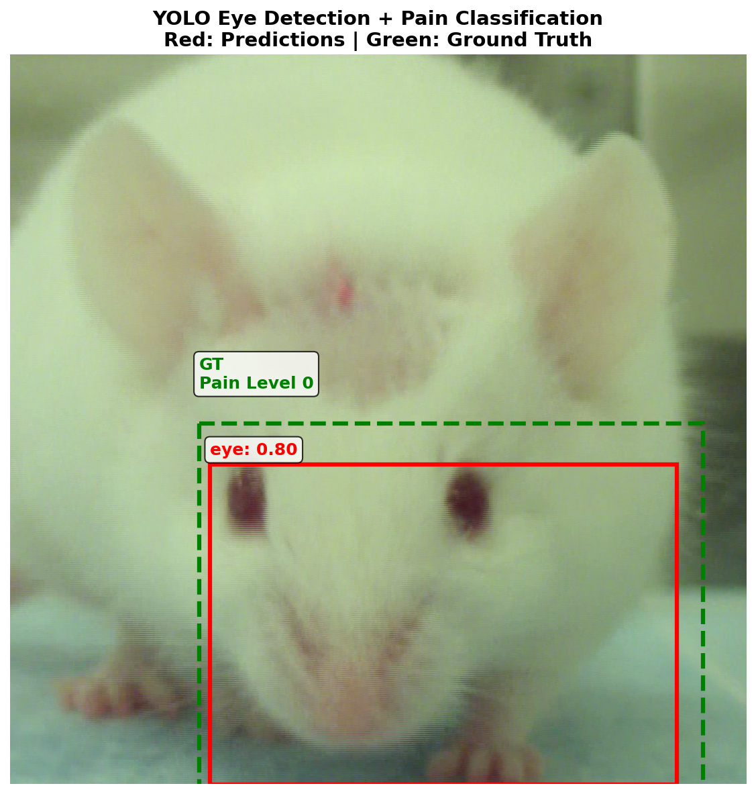
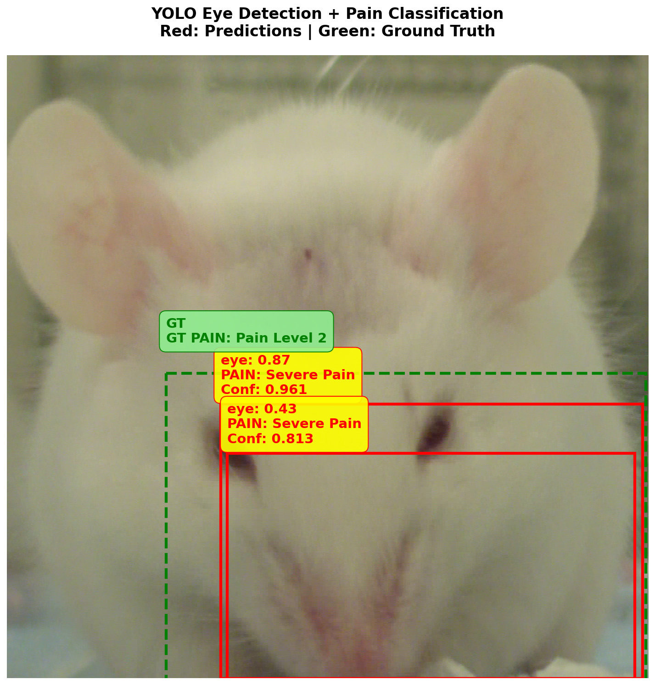

# labmouse

**Automated Pain Assessment in Laboratory Mice using YOLO and Deep Learning**

A two-stage deep learning system for automated detection and classification of pain levels in laboratory mice using the Mouse Grimace Scale (MGS). This project combines YOLO object detection for face localization with ResNet-18 classification to assess pain levels from facial expressions.

<center></center>

## Overview

This system addresses the challenge of objective pain assessment in laboratory animals by:
- **Detecting** mouse faces in images using a simplified YOLO architecture
- **Classifying** pain levels (0-2 on MGS scale) using transfer learning with ResNet-18


<center></center>

## Technical Architecture

### Stage 1: Face Detection (YOLO)
- Simplified YOLO implementation with 5 convolutional blocks
- Input: 416×416 images → Output: 13×13 detection grid
- 3 anchor boxes optimized for mouse face sizes

### Stage 2: Pain Classification (ResNet-18)
- Transfer learning from ImageNet
- Custom classification head with dropout regularization
- Input: 224×224 face crops → Output: 3-class pain predictions

## Installation

```bash
git clone https://github.com/username/labmouse
cd labmouse
pip install -r requirements.txt
```

## Project Structure

```
labmouse/
├── data/                          # raw dataset files
├── docs/                          # project's official documentation
├── Eyes_detection/                # eye dataset (1)
├── Face_detection/                # face dataset (2)
├── metrics/                       # training metrics and evaluation
│   └── plots/                     
├── models/                        # trained model weights
├── notebooks/                     
```

## Dataset

- **3,309 images** from the White Furred Mice Dataset
- **8 individual mice** with manual MGS annotations
- **Data augmentation**: horizontal flipping, scaling, HSV jittering
- Split: 80% training, 20% validation

## Results

- **YOLO Detection**: Loss reduced from ~8 to ~2 over 5 epochs
- **Pain Classification**: 84% training accuracy, with good face localization
- **Real-time Performance**: Suitable for automated monitoring systems

## Mouse Grimace Scale (MGS)

The system evaluates pain based on facial features:
- **Eyes**: Orbital tightening and squinting
- **Nose/Cheeks**: Bulging and distortion
- **Ears**: Position changes
- **Whiskers**: Positioning alterations

## Usage

```python
from Face_detection.yolo import SimpleYOLO
from Eyes_detection.classifier import PainClassifier

yolo_model = SimpleYOLO()
pain_classifier = PainClassifier()

yolo_model.load_state_dict(torch.load('models/yolo_weights.pth'))
pain_classifier.load_state_dict(torch.load('models/classifier_weights.pth'))

detections = yolo_model(image)
pain_level = pain_classifier(cropped_face)
```

## Scientific Background

This implementation is based on the Mouse Grimace Scale developed by Langford et al. (2010), providing an objective method for pain assessment that:
- Reduces observer bias
- Enables continuous monitoring
- Improves animal welfare in research settings

## Acknowledgments

- **Dataset**: A. Vidal, S. Jha, S. Hassler, T. Price, C. Busso (2022)
  - [White Furred Mice Dataset](https://lab-msp.com/WhiteFurredMiceDataset/)
  - [GitHub Repository](https://github.com/AndreaVidal/WhiteFurredMice_Dataset)
- **Original MGS**: Langford et al. (2010), Nature Methods
- **Architectures**: YOLO (Redmon et al., 2016), ResNet (He et al., 2016)

## License

MIT